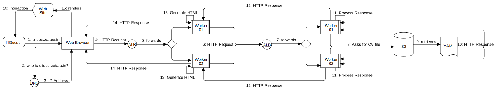

# 👨🏽‍💻 Project: `Portfolio`

   

This project aims to be [my personal website][ulises-zatarain] and also an interactive portfolio that shows my Curriculum Vitae and comprehensive details about relevant projects I have been working on my academic and professional career in order to have a proof of my knowledge and skills.

## 🗂️ Table of content

* 🔭 [Overview](#-overview)
  * 🎫 [Requirements](#-requirements)
    * 💻 [Show my curriculum](#-show-my-curriculum)
    * 🤓 [Show my personal life](#-show-my-personal-life)
    * 📧 [Contact me by e-mail](#-contact-me-by-e-mail)
    * 💾 [Download my curriculum](#-download-my-curriculum)
    * 📱 [Responsive website](#-responsive-website)
    * 🔒 [Secure connection](#-secure-connection)
  * 🤔 [Assumptions and disclaimers](#-assumptions-and-disclaimers)
* 📐 [Design](#-design)
* ✅ [Testing](#-testing)
  * 🤖 [Automated Unit Tests](#-automated-unit-tests)
  * 💯 [Coverage](#-coverage)
* 📚 [References](#-references)

## 🔭 Overview

This web application not only will show general information about myself and my personal life, but also who I am professionally and academically, so I can show to other people what I have done in my career in a professional but more importantly in a fun way. Additionally, it will include a way to contact me and download my curriculum.

The whole project is broken down in three parts: front-end (a website), back-end (an API) and infrastructure. This repository will contain the front-end and back-end together, while the infrastructure will be managed using Terraform in my other personal project repository [Lorentz][lorentz].

### 🎫 Requirements

There will be two main mandatory non-functional requirements in the development of this project:

1. The first and most important one is **get fun and enjoy**. As software engineer I want and need to show my passion and enjoyment for the technology. So, this website should speak itself about that.
2. Any hard skill or technology mentioned in my curriculum should be exemplified either on the website or within this project development in some way. This is in order to prove I actually have that hard skill or knowledge about that technology.

Other functional and non-functional requirements are detailed on following subsections.

#### 💻 Show my curriculum

The homepage of the website should show my curriculum vitae including my professional and academic career. The most relevant projects should be highlighted and have a link to provide further information. The data should be dynamic and retrieved from the back-end API.

#### 🤓 Show my personal life

The homepage should also show details about some of my personal life activities. The website should contain subsections with further information and more activities I do and enjoy.

#### 📧 Contact me by e-mail

The website should provide a way to contact me via e-mail and have some mechanism to control potential spam coming from bots. Neither my email addresses nor my phone numbers should not be shown directly on the website. So, the user needs to provide their name and a way to contact them back.

#### 💾 Download my curriculum

The guest users should have a way to download a printable version of my curriculum vitae as a PDF. The PDF should continue being *user interactive* even if is printed. This means, some of the links should continue working when the user physically print the document (e. g. the document includes QR codes).

#### 📱 Responsive website

All the sections of website should be readable either if the guest is using a computer or a mobile device like a phone or tablet. This should be tested at least on de default devices listed on the development tools of chromium-based browsers.

### 🔒 Secure connection

The whole web application should be under secure connection using safe protocols and layers (e. g. HTTPS, TLS, SSL certificates). When the user use an insecure connection, they should be redirected to a secure version of the application.

### 🤔 Assumptions and disclaimers

Following are some of the assumptions taken before and during the development of this project:

* Initially this project will be under a single domain name `zatara.in`, but the actual website on the subdomain `ulises.zatara.in`. So, all the sections will be under an URL of that hostname or another subdomain of it (e. g. `api.ulises.zatara.in`). However, it could be possible this change in the near or mid future, so we try to have the infrastructure prepared for that possibility (e. g. multi-region or multi-language websites).
* In order to fulfill the second requirement there could be some over-engineering work for didactical purposes, but that needs to be carefully taken to avoid increase the costs or find a way to mitigate them (e.g. multiple cloud accounts and stages).

## 📐 Design

This section aims to provide an overview of the architecture of the web application and its infrastructure. This needs to be updated over the time when the requirements change and/or new features are implemented or removed.

I am using Terraform to provision the infrastructure on my AWS account. Following diagram shows the current architecture:

## ✅ Testing

This project is able to be tested in manual way and with automated unit testing. This section will explain how can you play around with the API and the website locally after the set up.

### 🤖 Automated Unit Tests

Automated unit testing has been implemented and they run on each push and pull requests within the GitHub Actions Pipelines and when the Docker image is build. Following is how they are shown in [GitHub website][portfolio-actions]:

Some of those unit testing use [DDT (Data Driven Testing) approach][data-driven-testing] in order to test different inputs for similar scenarios or expected behaviours.

### 💯 Coverage

You can follow the test coverage reports of this project in the [CodeCov website][codecov-portfolio]:

| Sun Burst                      | iCicle                    | Grid                  |
| :----------------------------: | :-----------------------: | :-------------------: |
| ![Sun Burst][codecov-sunburst] | ![iCicle][codecov-icicle] | ![Grid][codecov-grid] |

**IMPORTANT NOTE:** Even if we had good coverage, that doesn't mean the API would be flawless, as it was mentioned in the [Assumptions section](#-assumptions-and-disclaimers) there are many chances to improve and for sure it may have even more.

## 📚 References

* [Ruby On Rails Documentation][ror-docs]
* [Next JS Documentation][next-docs]
* [GitHub Actions Documentation][github-actions-docs]

---

[ulises-zatarain]: https://ulises.zatara.in
[lorentz]: https://github.com/zatarain/lorentz
[ror-docs]: https://api.rubyonrails.org
[next-docs]: https://nextjs.org/docs
[github-actions-docs]: https://docs.github.com/en/actions
[codecov-portfolio]: https://app.codecov.io/gh/zatarain/portfolio
[codecov-sunburst]: https://codecov.io/gh/zatarain/portfolio/branch/main/graphs/sunburst.svg?token=CKLB4JPO9T
[codecov-grid]: https://codecov.io/gh/zatarain/portfolio/branch/main/graphs/tree.svg?token=CKLB4JPO9T
[codecov-icicle]: https://codecov.io/gh/zatarain/portfolio/branch/main/graphs/icicle.svg?token=CKLB4JPO9T
[portfolio-actions]: https://github.com/zatarain/portfolio/actions
[data-driven-testing]: https://en.wikipedia.org/wiki/Data-driven_testing
