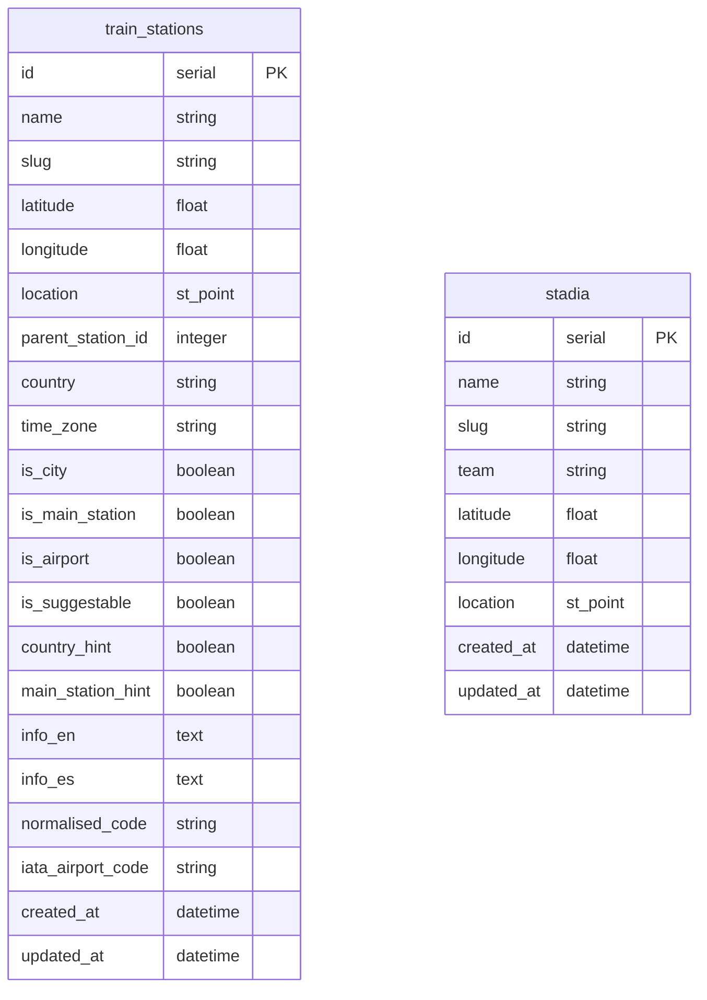

# 👨🏽‍💻 Project: `Geo-Football on Rails` [](https://opensource.org/licenses/BSD-3-Clause)

This prototype project aims to be an exercise to to discuss about software engineering technical topics like software development, security, deployment, databases, spatial data layers, etcetera. More specifically, to discuss the development of an [API (Application Programming Interface)][what-is-api] to **manage spatial data layers** implemented written in Ruby with [Ruby on Rails framework][ror-web] and other open source libraries.

## 🗂️ Table of content

* 🔭 [Overview](#-overview)
  * 🎫 [Requirements](#-requirements)
    * 🖥️ [API Service](#-api-service)
    * 🖼️ [Web Application](#-web-application)
  * 🤔 [Assumptions](#-assumptions)
* 📐 [Design](#-design)
  * 📊 [Data model](#-data-model)
    * 🚂 [Train Stations](#-train-stations)
    * 🏟️ ~~[Stadiums](#-stadiums)~~ *(coming soon...)*
  * 🔚 [End-points](#-end-points)
    * 📃 [GET `/stations`](#-get-stations)
    * ➕ [POST `/stations`](#-post-stations)
    * ➖ [DELETE `/stations/:id`](#-delete-stationsid)
* 🏗️ [Implementation details](#-implementation-details)
  * 📦 [Dependencies](#-dependencies)
  * 🗄️ [Storage](#-storage)
  * ✅ [Testing](#-testing)
  * 🔐 [Security](#-security)
  * ⏩ [Deployment](#-deployment)
  * 💭 [Future work](#-future-work)
* 📚 [References](#-references)

## 🔭 Overview

As I am fan of the trains and football, the API will manage two types of spatial data features: Train Stations and Football Stadiums. The main goal in the future will be determine closest train station to a given stadium.

This prototype won't be only the API, it also include a web application to render de spatial data layer in a map in order to visualise de data.

### 🎫 Requirements

The application will be split on two parts: an API as a back-end and a web application as front-end.

### 🖥️ API Service

The initial requirements for the API will be following:

* **List all the stations.** The application should provide an end-point to retrieve the stations in the data layer with a `GET` request.
* **Add a new train station.** The API will include an end-point to be able to add a new station with a `POST` request.
* **Remove an existing train station.** It should provides an end-point to remove an existing station with a `DELETE` request.

### 🖼️ Web Application

The web application initially should just visualise the data layer in a map. The map
should allow users to zoom in and zoom out.

Additionally, it will provide a way to access the API end-points to manipulate the spatial data (e. g. add and remove stations).

## 🤔 Assumptions

As this is just a small prototype right now it's not taking care about some corner case scenarios like following:

* In order to deploy the application, I will use the same [repository][zatarain-portfolio] as [my own portfolio website][zatarain-website] (under **`https://ulises.zatara.in/geo-football`**) as it has all the required infrastructure already and it meets the technical requirements (API in Ruby on Rails, PostgreSQL database with [PostGIS extension enabled][migrate-enable-postgis] and a website in TypeScript and NodeJS using NextJS framework for React). And it also has different environments already: `Development`, `Staging`, `Production`.
* To provision the infrastructure to [Amazon Web Services][aws-amazon] of that repository I use another of my personal projects called [Lorentz][zatarain-lorenz] which is an Infrastructure as a Code project to provision AWS resources for my personal projects.
* The website is public an anybody can access to it to read/write spatial data. In the real world, it should be behind an authentication and authorisation system where a user without enough privileges may have read-only access to visualise the data on the map.
* For now the remove action doesn't require confirmation. In the future it will require confirmation through a modal box asking to the user if they really want to delete a record.
* In order to manage the spatial data, the application will use the Spatial Reference System [WGS 84 - EPSG:4326][EPSG-4326-WGS84], which is basically Latitude/Longitude Coordinate System.
* The dataset for the stations comes from a CSV file in a [Trainline EU repository][trainline-eu-stations] and used [QGIS][qgis-web] to parse it to PostgresSQL then clean it a little bit by removing some fields I don't need. That data set include train stations across all Europe 😍, but for the purposes of this exercise I will use only the UK ones an neighbourhood areas.

## 📐 Design

The architecture will be a HTTP API for a microservice that will consume some configuration and use ORM to represent the records in the database tables and also a Model-View-Controller (MVC) pattern design, so the **controllers** will contain the handlers for the API requests, while the **models** will represent and manipulate the data; finally the Ruby on Rails part won't actually have a **views**, the end-points will render JSON instead which will be processed by the website application (we can say this would be *the actual view*).

The service will be stateless, so we won't hold any state (e. g. session management) on the server side. Following subsections will describe more details about the design: Data model, End-points and the visualisation part.

### 📊 Data model

In order to store and manipulate the data needed the API will rely on entities `TrainStation` and `Stadium` which are stored within following tables in the database:



The table names are in plural to follow the convention from Ruby on Rails framework (and Ulises' conventions too 😅). In the future those entities may be related someway based-on their location. For now, we will focus mainly or only in the `train_stations`.

The columns of `train_stations` table are actually way more as they come from the Trainline EU dataset, but for the purpose of this exercise I will use only the ones described in the next subsection.

#### 🚂 Train Stations

This entity will represent the spatial layer for train stations in the system and each record will represent a feature of the data layer and will be stored in the table `train_stations` which has following fields:

| ⏹️ | Name         |     Type       | Description                                                                  |
|:--:| :---         |    :----:      | :---                                                                         |
| 🗝️ | `id`         | `SERIAL`       | Auto-numeric identifier for the station                                      |
| 🔤 | `name`       | `VARCHAR(255)` | Name of the train station                                                    |
| 🔢 | `latitude`   | `FLOAT`        | The latitude coordinate also included within location field                  |
| 🔢 | `longitude`  | `FLOAT`        | The longitude coordinate also included within location field                 |
| 📌 | `location`   | `ST_POINT`     | The spatial point with the coordinates of the station                        |
| 🗾 | `country`    | `VARCHAR(2)`   | ISO code for the country where the station is                                |
| ⏲️ | `time_zone`  | `VARCHAR(64)`  | The time zone for the station                                                |
| 🔤 | `info_en`    | `TEXT`         | Additional information in English language                                   |
| 🗓️ | `created_at` | `DATETIME`     | Timestamp representing the creation time, defaults to `CURRENT_TIMESTAMP`    |
| 🗓️ | `updated_at` | `DATETIME`     | Timestamp representing the last update time, defaults to `CURRENT_TIMESTAMP` |

For this entity only `name`, `latitude` and `longitude` will be required to **not** be `null` as input of the API. The fields `id`, `location`, `created_at` and `updated_at` will be autogenerated either by the database itself, Ruby on Rails or the `GeoLocalisable` concern (more details below).

**Note (1)** that the fields `latitude` and `longitude` are also included within the `location` field, so in principle they actually don't need to be separately stored as they are duplicated, but I decided to leave them, sometimes they might be useful either for debugging queries or for other purposes.

**Note (2)** that I am using `FLOAT` for the coordinates, while other applications may need more precision and then require to use `REAL` or even `DOUBLE`, I think for this prototype `FLOAT` should be enough.

In the code, that entity is represented with the model [`TrainStation`][train-station-model] which also uses [`GeoLocalisable`][geo-localisable-concern] concern to manage the spatial data. Concerns in Ruby on Rails are a way to isolate and share functionality and behaviours between similar classes, for instance in the future we will have the model `TrainStation` and also the `Stadium` and both of them would be using `GeoLocalisable` which means they need to perform same validations for spatial input data:

* Generate `ST_Point` value of the `location` from `latitude` and `longitude`
* Validate `latitude` and `longitude` are present
* Validate `latitude` to be a numeric value in the closed interval `[-90.00, 90.00]`
* Validate `longitude` to be a numeric value in the closed interval `[-180.00, 180.00]`

The `GeoLocalisable` concern also provides methods to perform spatial queries. For instance, I implemented a method to look for features `within_box` using the PostGIS SQL function `ST_MakeEnvelope` in the query. This is one of the most simplest ones but, it could be more complex queries later.

Last, but not least, I added indexes to some columns of the table that may have recurrent queries: `name`, `country`, `time_zone` and `latitude` and `longitude` (together). But, the most important one is an **spatial index** for the `location` field. More details about the table definition can be found in [the code of the migration to create the table][migrate-train-stations].

### 🔚 End-points

The input for all the API end-points that require it, will be always in JSON format or within the path itself (e. g. `/:id/`) and the output will be in the same format.

The end-points implemented (so far) in the class [`StationsController`][stations-controller] are described in following table:

| HTTP Verb | Address         | Description                             | Success Status | Possible Failure Status                        |
| :---:     | :---            | :----                                   | :---:          | :---                                           |
| `GET`     | `/stations`     | List of all stations within a fixed box | `200 OK`       | `500 Internal Server Error`                    |
| `POST`    | `/stations`     | Create a station record in the system   | `200 OK`       | `400 Bad Request`, `500 Internal Server Error` |
| `DELETE`  | `/stations/:id` | Delete a station from the system        | `200 OK`       | `404 Not Found`, `500 Internal Server Error`   |

In order to hit the end-point of the API we can do it with the URL `https://api.ulises.zatara.in/end-point` either using a web browser or an application like [Postman][postman-website]. Following is how a `POST` request would looks in Postman:


#### 📃 GET `/stations`

This end-point doesn't receive any input ***yet*** and it returns a JSON with a list of stations within a fixed box [`(49.00, -7.00)`,`(60.00,  7.00)`] which is a box boundary to include United Kingdom. Following is a sample of the output data:

```json
[
  {
    "id": 43,
    "name": "Auboué",
    "slug": "auboue",
    "latitude": 49.216163,
    "longitude": 5.9714608,
    "location": "POINT (5.9714608 49.216163)",
    "parent_station_id": null,
    "country": "FR",
    "time_zone": "Europe/Paris",
    "is_city": false,
    "is_main_station": false,
    "is_airport": false,
    "is_suggestable": true,
    "country_hint": false,
    "main_station_hint": false,
    "info_en": null,
    "info_es": null,
    "normalised_code": "urn:trainline:public:nloc:csv43",
    "iata_airport_code": null,
    "created_at": "2023-07-12T18:18:00.479Z",
    "updated_at": "2023-07-12T18:18:00.479Z"
  },
  {
    "id": 55,
    "name": "Aboncourt",
    "slug": "aboncourt",
    "latitude": 49.266667,
    "longitude": 6.35,
    "location": "POINT (6.35 49.266667)",
    "parent_station_id": null,
    "country": "FR",
    "time_zone": "Europe/Paris",
    "is_city": false,
    "is_main_station": false,
    "is_airport": false,
    "is_suggestable": true,
    "country_hint": false,
    "main_station_hint": false,
    "info_en": null,
    "info_es": null,
    "normalised_code": "urn:trainline:public:nloc:csv55",
    "iata_airport_code": null,
    "created_at": "2023-07-12T18:18:00.479Z",
    "updated_at": "2023-07-12T18:18:00.479Z"
  },
  {
    "id": 65,
    "name": "Abancourt",
    "slug": "abancourt",
    "latitude": 49.6852237,
    "longitude": 1.7743058,
    "location": "POINT (1.7743058 49.6852237)",
    "parent_station_id": null,
    "country": "FR",
    "time_zone": "Europe/Paris",
    "is_city": false,
    "is_main_station": false,
    "is_airport": false,
    "is_suggestable": true,
    "country_hint": false,
    "main_station_hint": false,
    "info_en": null,
    "info_es": null,
    "normalised_code": "urn:trainline:public:nloc:csv65",
    "iata_airport_code": null,
    "created_at": "2023-07-12T18:18:00.479Z",
    "updated_at": "2023-07-12T18:18:00.479Z"
  }
]
```

#### ➕ POST `/stations`

This end-point allow us to create a new feature for the spatial layer (or just insert a new record/row in the table `train_stations`). It required the name of the station and the separate coordinates as input, then the `POINT` will be generated on behind the scenes by the model and the concern if the coordinates are valid values. Following is an example of the minimum input:

```json
{
  "name": "Canary Wharf",
  "latitude": 51.50361,
  "longitude": -0.01861
}
```

A more extended or completed input could be:

```json
{
  "name": "Canary Wharf",
  "slug": "canary-wharf",
  "country": "GB",
  "time_zone": "Europe/London",
  "latitude": 51.50361,
  "longitude": -0.01861,
  "info_en": "London Underground Station",
  "info_es": "Estación del Metro de Londres"
}
```

The end-point will return the whole new record. For example:

```json
{
  "id": 68185,
  "name": "Canary Wharf",
  "slug": "canary-wharf",
  "latitude": 51.50361,
  "longitude": -0.01861,
  "location": "POINT (-0.01861 51.50361)",
  "parent_station_id": null,
  "country": "GB",
  "time_zone": "Europe/London",
  "is_city": false,
  "is_main_station": false,
  "is_airport": false,
  "is_suggestable": false,
  "country_hint": false,
  "main_station_hint": false,
  "info_en": "London Underground Station",
  "info_es": "Estación del Metro de Londres",
  "normalised_code": null,
  "iata_airport_code": null,
  "created_at": "2023-07-14T07:19:05.152Z",
  "updated_at": "2023-07-14T07:19:05.152Z"
}
```

This end-point can be tested in Postman with a POST to `https://api.ulises.zatara.in/stations` or using the web interface ([**`https://ulises.zatara.in/geo-football`**][geo-football]) and **double clicking on the map** which looks like following:


#### ➖ DELETE `/stations/:id`

This end-point allows to remove features from the `train_stations` spatial layer. It receives the `id` (primary key of the record) within the path of the URL. It doesn't return any output, just the status code of the HTTP request. For instance, if we would like to remove a record we can do it with `DELETE` HTTP request to `https://api.ulises.zatara.in/stations/68185` which would remove the record with `id = 68185` if it exists.

## 🏗️ Implementation details

As it's been mentioned on earlier sections, this prototype is hosted on my personal website and I been using following tech stack:

* Ruby on Rails for the back-end
* React and NextJS with Typescript in the front-end
* Terraform and AWS for the cloud infrastructure
* The database is a PostgreSQL instance with PostGIS extension
* Docker containers to isolate different ends of the whole system

### 📦 Dependencies

In addition to the stack mentioned, the application rely on open source dependencies. Those dependencies are weekly updated trough [Github `dependabot`][github-dependabot]. Following are some examples of them:

#### Back-End

* **`gem 'pg'`** to use PostgreSQL as the database for Active Record
* Gems to manipulate PostGIS data:
  * `gem 'activerecord-postgis-adapter'`
  * `gem 'rgeo'`
  * `gem 'rgeo-activerecord'`

#### Front-End

* **[Leaflet][leaflet-website]** is a JavaScript library to present visualise maps in a web browser.
* **[`react-leaflet`][react-leaflet]** is a package adaptation of Leaflet to use React components.
* **[`react-leaflet-cluster`][react-leaflet-cluster]** is a plugin to *clusterise* the Markers within a Leaflet map.
* **[`react-hook-form`][react-hook-forms]** is a package to manage forms and input fields in React style.

#### Graphical and data resources

* I am also using [Open Street Maps][osm-website] Standard Layer to visualise the train stations.
* The icons for the markers in the map come from [Flat Icon Website][flat-icon].
* As mentioned before, the dataset comes from the [Trainline EU Stations repository][trainline-eu-stations].

### ✅ Testing

I added some unit testing on the project, but they are mainly focus on the `INSERT` query for the train stations and the generation of the location `POINT`. They basically test concern and the model.

Unfortunately, the test coverage of the repository has been damaged producing technical debt that needs to be addressed soon 😭😿.

### 🔐 Security

Regarding the security, all the secrets for the application are managed within the infrastructure layer using [AWS Secret Manager][aws-secret-manager]. I actually might not know either the usernames nor the passwords for the database for example and they automatically rotate every week 😊. Also, only the development database is publicly accessible and only from the IP my machine by using AWS EC2 Security Groups; test and production database instances are only accessible within the VPC.

The application is using SSL certificates, so the API and the website require to use HTTPS protocol to hit the end-points. If we use plain HTTP, the load balancer will redirect to use HTTPS through a `HTTP 301` status.

I have `3` different and isolated environments: `Development`, `Staging` and `Production`. They don't even know each other as they live in different AWS accounts and have different Terraform states via Terraform Workspaces. The secrets they hold are also different of course.

### ⏩ Deployment

The deployment is performed automatically by a [CI/CD pipelines][portfolio-pipelines] (one workflow for each back-end and front-end) within [Github Actions][github-actions-docs]. Every time I open a pull request and/or merge changes the pipelines are triggered and if the changes were merged to `deployment`, `staging` or `main` branches, the workflow will include a deployment to the correspondent environment.

The deployment includes the build of the Docker images for the containers and the push those images to [AWS Elastic Container Registry][aws-ecr] of the correspondent account and then reload the services for the front-end and back-end in the cluster within [AWS Elastic Container Service][aws-ecs] which holds the [Fargate][aws-fargate] workers for the service task definitions.

### 💭 Future work

As mentioned in the [Assumptions](#-assumptions) and other sections, there are several rooms for improvement:

* Add an authentication and authorisation layer, so the user need to login to have access to write data.
* Add more unit testing to reduce the technical debt an return the whole portfolio project to the good coverage.
* Add a confirmation for the delete request on the UI.
* Add more end-points to edit stations and leverage the other fields.
* Actually support the stadiums and compute the closest train stations based-on fastest and shortest paths.
* Make sure everything also works on mobile devices.

## 📚 References

* [PostgreSQL][postgresql-web]
* [PostGIS][postgis-web]
* [GitHub Actions Documentation][github-actions-docs]
* [Leaflet documentation][leaflet-docs]
* [Open Street Maps][osm-website]

---

[what-is-api]: aws.amazon.com/what-is/api
[zatarain-website]: https:/ulises.zatara.in
[zatarain-portfolio]: https://github.com/zatarain/portfolio
[zatarain-lorenz]: https://github.com/zatarain/lorentz
[ror-web]: https://rubyonrails.org
[postgresql-web]: https://www.postgresql.org
[github-actions-docs]: https://docs.github.com/en/actions
[postgis-web]: http://postgis.net
[qgis-web]: https://qgis.org/en/site/
[EPSG-4326-WGS84]: https://en.wikipedia.org/wiki/World_Geodetic_System#WGS84
[trainline-eu-stations]: https://github.com/trainline-eu/stations
[aws-amazon]: https://aws.amazon.com
[stations-controller]: https://github.com/zatarain/portfolio/blob/main/api/app/controllers/stations_controller.rb
[train-station-model]: https://github.com/zatarain/portfolio/blob/main/api/app/models/train_station.rb
[geo-localisable-concern]: https://github.com/zatarain/portfolio/blob/main/api/app/models/concerns/geo_localisable.rb
[postman-website]: https://www.postman.com
[migrate-train-stations]: https://github.com/zatarain/portfolio/blob/main/api/db/migrate/20230710180003_train_stations.rb
[migrate-enable-postgis]: https://github.com/zatarain/portfolio/blob/main/api/db/migrate/20230710040341_postgis_enabler.rb
[leaflet-website]: https://leafletjs.com
[leaflet-docs]: https://leafletjs.com/reference.html#popup
[react-leaflet]: https://react-leaflet.js.org/docs/api-components
[react-leaflet-cluster]: https://www.npmjs.com/package/react-leaflet-cluster
[react-hook-forms]: https://react-hook-form.com/docs
[osm-website]: https://www.openstreetmap.org
[flat-icon]: https://www.flaticon.com/
[aws-secret-manager]: https://docs.aws.amazon.com/secretsmanager/latest/userguide/intro.html
[portfolio-pipelines]: https://github.com/zatarain/portfolio/actions
[aws-ecr]: https://aws.amazon.com/ecr/
[aws-ecs]: https://aws.amazon.com/ecs/
[aws-fargate]: https://aws.amazon.com/fargate/
[github-dependabot]: https://github.com/dependabot
[geo-football]: https://ulises.zatara.in/geo-football
