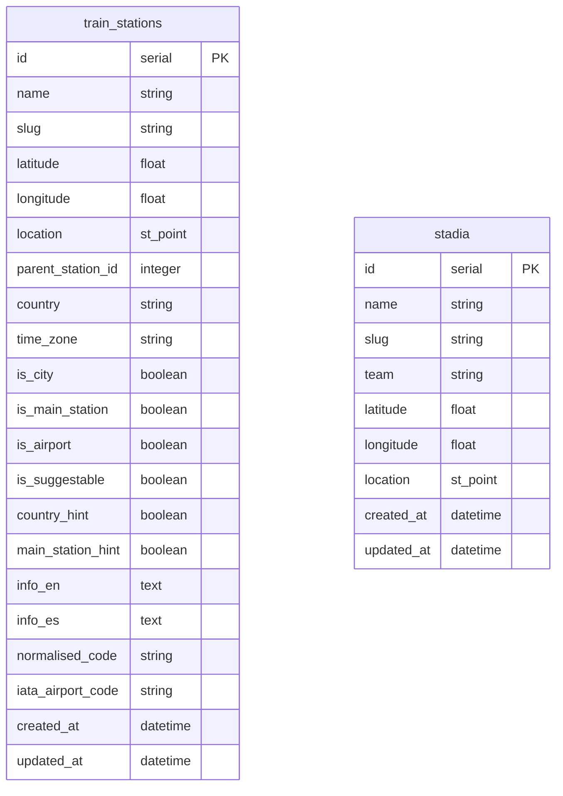

# 👨🏽‍💻 Project: `Geo-Football on Rails` 

This prototype project aims to be an exercise to to discuss about software engineering technical topics like software development, security, deployment, databases, spatial data layers, etcetera. More specifically, to discuss the development of an [API (Application Programming Interface)][what-is-api] to **manage spatial data layers** implemented written in Ruby with [Ruby on Rails framework][ror-web] and other open source libraries.

## 🗂️ Table of content

* 🔭 [Overview](#-overview)
  * 🎫 [Requirements](#-requirements)
    * 🖥️ [API Service](#-api-service)
    * 🖼️ [Web Application](#-web-application)
  * 🤔 [Assumptions](#-assumptions)
* 📐 [Design](#-design)
* ✅ [Testing](#-testing)
  * 🤖 [Automated Unit Tests](#-automated-unit-tests)
  * 💯 [Coverage](#-coverage)
* 📚 [References](#-references)

## 🔭 Overview

As I am fan of the trains and football, the API will manage two types of spatial data features: Train Stations and Football Stadiums. The main goal in the future will be determine closest train station to a given stadium.

This prototype won't be only the API, it also include a web application to render de spatial data layer in a map in order to visualise de data.

### 🎫 Requirements

The application will be split on two parts: an API as a back-end and a web application as front-end.

### 🖥️ API Service

The initial requirements for the API will be following:

* **List all the stations.** The application should provide an end-point to retrieve the stations in the data layer with a `GET` request.
* **Add a new train station.** The API will include an end-point to be able to add a new station with a `POST` request.
* **Remove an existing train station.** It should provides an end-point to remove an existing station with a `DELETE` request.

### 🖼️ Web Application

The web application initially should just visualise the data layer in a map. The map
should allow users to zoom in and zoom out.

Additionally, it will provide a way to access the API end-points to manipulate the spatial data (e. g. add and remove stations).

## 🤔 Assumptions

As this is just a small prototype right now it's not taking care about some corner case scenarios like following:

* In order to deploy the application, I will use the same [repository][zatarain-portfolio] as [my own portfolio website][zatarain-website] (under **`https://ulises.zatara.in/geo-football`**) as it has all the required infrastructure already and it meets the technical requirements (API in Ruby on Rails, PostgreSQL database with PostGIS extension enabled and a website in TypeScript and NodeJS using NextJS framework for React). And it also has different environments already: `Development`, `Staging`, `Production`.
* To provision the infrastructure to [Amazon Web Services][aws-amazon] of that repository I use another of my personal projects called [Lorentz][zatarain-lorenz] which is an Infrastructure as a Code project to provision AWS resources for my personal projects.
* The website is public an anybody can access to it to read/write spatial data. In the real world, it should be behind an authentication and authorisation system where a user without enough privileges may have read-only access to visualise the data on the map.
* For now the remove action doesn't require confirmation. In the future it will require confirmation through a modal box asking to the user if they really want to delete a record.
* In order to manage the spatial data, the application will use the Spatial Reference System [WGS 84 - EPSG:4326][EPSG-4326-WGS84], which is basically Latitude/Longitude Coordinate System.
* The dataset for the stations comes from a CSV file in a [Trainline EU repository][trainline-eu-stations] and used [QGIS][qgis-web] to parse it to PostgresSQL then clean it a little bit removing some fields I don't need.

## 📐 Design

### 📊 Data model

In order to store and manipulate the data needed the API will rely on entities `TrainStation` and `Stadium` which are stored within following tables in the database:

The table names are in plural to follow the convention from Ruby on Rails framework (and Ulises' conventions too 😅). In the future those entities may be related someway based-on their location. For now, we will focus mainly or only in the `train_stations`.

The columns of `train_stations` table are actually way more as they come from the Trainline EU dataset, but for the purpose of this exercise I will use only the ones described in the next subsection.

#### 🚂 Train Stations

This entity will represent the spatial layer for train stations in the system and each record will represent a feature of the data layer and will be stored in the table `train_stations` which has following fields:

| ⏹️ | Name         |     Type       | Description                                                  |
|:--:| :---         |    :----:      | :---                                                         |
| 🗝️ | `id`         | `SERIAL`       | Auto-numeric identifier for the station                      |
| 🔤 | `name`       | `VARCHAR(255)` | Name of the train station                                    |
| 🔢 | `latitude`   | `FLOAT`        | The latitude coordinate also included within location field  |
| 🔢 | `longitude`  | `FLOAT`        | The longitude coordinate also included within location field |
| 📌 | `location`   | `ST_POINT`     | The spatial point with the coordinates of the station        |
| 🗾 | `country`    | `VARCHAR(2)`   | ISO code for the country where the station is                |
| ⏲️ | `time_zone`  | `VARCHAR(64)`  | The time zone for the station                                |
| 🔤 | `info_en`    | `TEXT`         | Additional information in English language                   |
| 🗓️ | `created_at` | `DATETIME`     | Timestamp representing the creation time                     |
| 🗓️ | `updated_at` | `DATETIME`     | Timestamp representing the last update time                  |

**Note** that the `latitude` and `longitude` are also included within the `location` field, so in principle they actually don't need to be separately stored as they are duplicated, but I decided to leave them, sometimes they might be useful either for debugging queries or for other purposes.

## 📚 References

* [PostgreSQL][postgresql-web]
* [PostGIS][postgis-web]
* [GitHub Actions Documentation][github-actions-docs]

---

[what-is-api]: aws.amazon.com/what-is/api
[zatarain-website]: https:/ulises.zatara.in
[zatarain-portfolio]: https://github.com/zatarain/portfolio
[zatarain-lorenz]: https://github.com/zatarain/lorentz
[ror-web]: https://rubyonrails.org
[postgresql-web]: https://www.postgresql.org
[github-actions-docs]: https://docs.github.com/en/actions
[postgis-web]: http://postgis.net
[qgis-web]: https://qgis.org/en/site/
[EPSG-4326-WGS84]: https://en.wikipedia.org/wiki/World_Geodetic_System#WGS84
[trainline-eu-stations]: https://github.com/trainline-eu/stations
[aws-amazon]: https://aws.amazon.com
