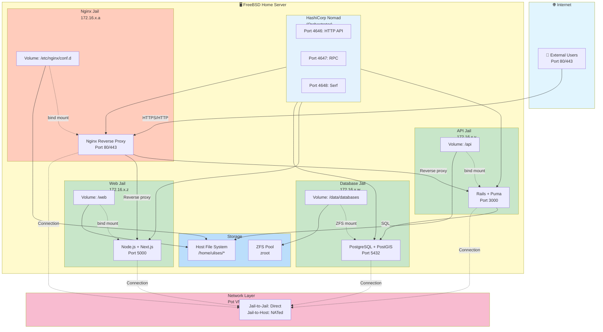
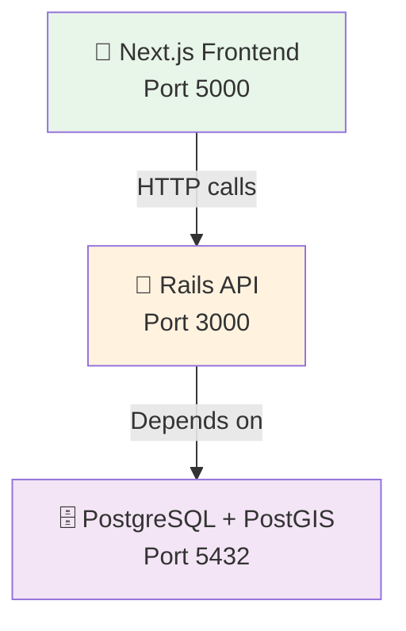
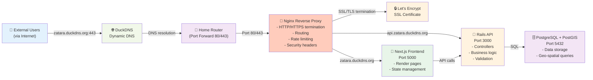
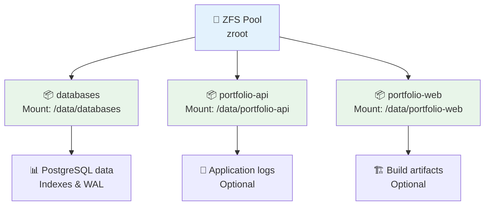

# 📋 Architecture Overview

This document describes the complete architecture for deploying your portfolio application on FreeBSD using Nomad, Pot, and Jails.

## 📊 System Architecture Diagram



## 📆 Service Dependencies



## 🔄 Data Flow



## 📁 File Structure

```
portfolio/                         # Your project root (any location)
├── api/                          # Rails backend
│   ├── app/
│   ├── config/
│   ├── db/
│   ├── Gemfile
│   ├── config.ru
│   └── ...
├── web/                          # Next.js frontend
│   ├── src/
│   ├── pages/
│   ├── package.json
│   ├── next.config.js
│   └── ...
├── nomad/                        # Nomad orchestration (NEW)
│   ├── README.md                 # Quick overview
│   ├── SETUP.md                  # Complete setup guide
│   ├── QUICKSTART.md             # Quick-start checklist
│   ├── TROUBLESHOOT.md           # Troubleshooting guide
│   ├── ARCHITECTURE.md           # This file
│   ├── deploy.sh                 # Main deployment orchestrator
│   ├── jobs/                     # Nomad job definitions
│   │   ├── nginx.hcl             # Nginx reverse proxy job
│   │   ├── postgres.hcl          # PostgreSQL job
│   │   ├── api.hcl               # Rails API job
│   │   └── web.hcl               # Next.js job
│   ├── scripts/                  # Setup & initialization scripts
│   │   ├── nginx-setup.sh        # Nginx configuration setup
│   │   ├── nginx.conf            # Nginx reverse proxy config
│   │   ├── postgres-init.sh      # Database initialization
│   │   ├── api-setup.sh          # API setup
│   │   ├── web-setup.sh          # Web build
│   │   ├── postgres.env          # PostgreSQL env template
│   │   ├── api.env               # API env template
│   │   ├── web.env               # Web env template
│   │   └── templates/            # Static configuration files
│   │       ├── postgresql.conf   # PostgreSQL server settings
│   │       └── pg_hba.conf       # PostgreSQL auth config
│   └── pot/                      # Pot jail configuration
│       ├── setup-jails.sh        # Jail creation script
│       ├── env.sh                # Environment variables
│       ├── nomad-config-example.hcl
│       ├── pot-config-example.conf
│       └── health-checks/        # Service health check scripts
│           ├── postgres.sh       # Database health check
│           ├── api.sh            # API health check
│           └── web.sh            # Frontend health check
├── compose.yml                   # Original Docker Compose (for reference)
├── README.md
└── ...
```

(Replace `portfolio/` with your actual portfolio directory path)

## ⚡ Process Lifecycle

### On System Boot
1. FreeBSD kernel starts
2. ZFS mounts datasets
3. Nomad agent starts (if enabled in rc.conf)
4. Nomad client discovers no jobs (fresh state)
5. Jails remain in stopped state until Nomad tasks start them

### On First Job Submission
1. User runs `./nomad/deploy.sh`
2. Nomad schedules PostgreSQL job on available client
3. Task starts raw_exec driver
4. PostgreSQL initializes database (first time)
5. Health checks begin passing
6. API job scheduled
7. API connects to database, runs migrations
8. Web job scheduled
9. Web builds and starts serving requests

### Normal Operation
```
Continuous monitoring by Nomad:
Every 10s ─► Health checks run ─► If fail 3x ─► Restart process
             Task logs generated    Task restarted
             Metrics collected      Allocation preserved or rescheduled
```

### On Job Stop
1. User runs `nomad job stop portfolio-api`
2. Running tasks receive SIGTERM
3. Graceful shutdown period (default: 30s)
4. If not stopped, SIGKILL sent
5. Databases maintain persistent data (ZFS dataset)
6. Jails remain at OS level but tasks stop

## 🛠️ Script Organization & Files

The deployment uses external files instead of inline scripts for clarity and maintainability:

### Nomad Job Definitions (`jobs/`)
Each job file references external scripts and templates:
- **postgres.hcl** - References `scripts/postgres-init.sh` and config templates
- **api.hcl** - References `scripts/api-setup.sh`
- **web.hcl** - References `scripts/web-setup.sh`

### Setup & Initialization Scripts (`scripts/`)
These execute during task startup:

| Script | Purpose | Runs In |
|--------|---------|---------|
| `postgres-init.sh` | Create database, user, enable PostGIS | PostgreSQL jail |
| `api-setup.sh` | Install gems, run migrations | API jail |
| `web-setup.sh` | Install npm deps, build Next.js | Web jail |

### Configuration Templates (`scripts/templates/`)
Static files copied to appropriate locations:

| File | Destination | Purpose |
|------|-------------|---------|
| `postgresql.conf` | `/data/databases/pgdata/postgresql.conf` | PostgreSQL settings |
| `pg_hba.conf` | `/data/databases/pgdata/pg_hba.conf` | Connection auth rules |

### Environment Templates (`scripts/*.env`)
Nomad-aware templates with variable substitution:

| File | Variables | Destination |
|------|-----------|-------------|
| `postgres.env` | POSTGRES_PASSWORD, USERNAME | Task env |
| `api.env` | AWS_*, INSTAGRAM_*, POSTGRES_* | Task secrets |
| `web.env` | API_URL, NEXT_PUBLIC_API_URL | Task env |

### Jail Setup (`pot/`)
Initial jail configuration and setup:

| File | Purpose |
|------|---------|
| `setup-jails.sh` | Creates 3 jails, installs packages, sets up networking |
| `env.sh` | Sources environment variables |
| `nomad-config-example.hcl` | Example Nomad agent configuration |
| `pot-config-example.conf` | Example Pot configuration |

## 🛠️ Technology Stack

| Component | Technology | Version | Purpose |
|-----------|-----------|---------|---------|
| Host OS | FreeBSD | 13.2+ | Base operating system |
| Orchestration | Nomad | Latest stable | Job scheduling & execution |
| Jails | Pot | 0.15.0+ | Jail management wrapper |
| Filesystem | ZFS | FreeBSD native | Persistent storage |
| Backend | Rails | Latest | Web framework |
| Web Server | Puma | Built-in | Ruby application server |
| Frontend | Next.js | Latest | React framework |
| Node Runtime | Node.js | Latest | JavaScript runtime |
| Database | PostgreSQL | 14 | Primary datastore |
| GIS | PostGIS | 3.x | Geographic data |
| Language | Ruby | 3.2 | Backend language |

## 🌐 Networking Details

### Jail Network (VNET)
- **Bridge Network**: 172.16.0.0/16 (Pot default)
- **API Jail**: 172.16.0.x
- **Web Jail**: 172.16.0.y
- **Database Jail**: 172.16.0.z
- **Communication**: VNET jails can talk directly
- **NAT**: Outbound traffic NATed through host

### Port Mapping
- **3000** → Host:3000 → API Jail:3000 (Rails)
- **5000** → Host:5000 → Web Jail:5000 (Next.js)
- **5432** → Host:5432 → Database Jail:5432 (PostgreSQL)

### Internal Communication
- API → Database: Direct TCP connection (172.16.0.z:5432)
- Web → API: Configured via `NEXT_PUBLIC_API_URL` env var
- Browser → Web: Host port 5000 forwarded to jail
- Browser → API: Host port 3000 forwarded to jail (if direct)

## 💾 Storage Architecture

### Persistent Storage (ZFS Datasets)



### Bind Mounts (Source Code)
```
Host                                Jail
`portfolio/api` → `/api` (inside jail)
`portfolio/web` → `/web` (inside jail)
```

## 🔐 Security Considerations

### Network Isolation
- Jails provide OS-level isolation (like containers)
- Each jail has separate network namespace (VNET)
- No process can escape jail and run on host

### Data Protection
- PostgreSQL data encrypted at rest (if filesystem encrypted)
- Environment variables with secrets managed by Nomad
- No secrets in source code (use Nomad templates)

### Access Control
- Each jail has separate user/group space
- PostgreSQL requires authentication (md5/scram-sha-256)
- Rails environment variables restrict data access

## 🚀 High Availability Considerations

### Current Setup (Single Node)
- Single Nomad server/client
- Single deployment
- No redundancy
- Suitable for home server

### Future Scaling (Within Nomad)
To scale to multiple nodes:
1. Set `bootstrap_expect = 3` (multiple servers)
2. Configure `server_join` to other Nomad servers
3. Add more Nomad client nodes
4. Configure persistent PostgreSQL replication
5. Set up load balancing (reverse proxy)

## 📑 Backup Strategy

### Data Backups (ZFS Snapshots)
```sh
# Manual snapshot
zfs snapshot zroot/databases@backup-$(date +%s)

# Automated snapshot (add to cron)
*/6 * * * * zfs snapshot zroot/databases@auto-$(/bin/date +\%s)

# List snapshots
zfs list -t snapshot

# Restore from snapshot
zfs rollback zroot/databases@backup-123456789
```

### Application Backups
- Source code in git repository
- Nomad job definitions versioned (in nomad/ directory)

### Full System Backup
```sh
# ZFS send to file
zfs send -R zroot/databases | gzip > /backup/databases.zfs.gz

# Send to remote (with ssh)
zfs send -R zroot/databases | ssh remote "zfs recv tank/backups/..."
```

## ⚡ Performance Tuning

### PostgreSQL Optimization
In `postgres.hcl`, the initialization script sets:
- `shared_buffers = 256MB` (25-40% of RAM)
- `effective_cache_size = 1GB`
- `work_mem = 6600kB`
- `maintenance_work_mem = 64MB`

Adjust based on available system RAM.

### Rails Optimization
In `api.hcl`:
- `RAILS_MAX_THREADS = 5` (connection pool)
- `RAILS_MIN_THREADS = 2`
- CPU: 1000 millicores (1 vCPU equivalent)
- Memory: 1024 MB

### Next.js Optimization
In `web.hcl`:
- `NODE_OPTIONS = --max-old-space-size=512`
- CPU: 500 millicores
- Memory: 512 MB

## 📊 Monitoring & Logging

### Nomad Metrics (Built-in)
- Accessible at `http://localhost:4646/v1/agent/metrics`
- Prometheus format: `http://localhost:4646/v1/metrics`
- Includes: CPU, memory, disk usage per allocation

### Application Logs
- Rails: Via stdout (captured by Nomad)
- Next.js: Via stdout and /web/logs/
- PostgreSQL: Via /var/log/ in jail

### Log Aggregation (Future Enhancement)
Consider adding:
- Loki + Promtail (lightweight)
- EFK stack (more features)
- CloudWatch/Datadog (external service)

## 🚶 Disaster Recovery

### Failure Scenarios

#### Database Corruption
1. Stop API/Web jobs: `nomad job stop portfolio-api portfolio-web`
2. Rollback ZFS snapshot: `zfs rollback zroot/databases@backup-123456789`
3. Restart jobs: `nomad job run jobs/*.hcl`

#### Complete Jail Failure
1. Destroy failed jail: `pot destroy databases`
2. Recreate from scratch: `sudo sh nomad/pot/setup-jails.sh`
3. Resubmit Nomad job (data persists in ZFS)

#### System Failure / Power Loss
1. Boot system normally
2. ZFS mounts automatically
3. Nomad agent starts and resumes jobs
4. Services come back online automatically

## 📇 Documentation Map

- **SETUP.md** - Complete installation and configuration guide
- **QUICKSTART.md** - Step-by-step deployment checklist
- **TROUBLESHOOT.md** - Common issues and solutions
- **ARCHITECTURE.md** - This file (system design)
- **jobs/*.hcl** - Individual service job definitions
- **pot/env.sh** - Environment variables template
- **deploy.sh** - Automated deployment script

---

**Last Updated:** March 2026
**Suitable For:** FreeBSD 13.2+, Home Server Environment
**Main Services:** Rails API, Next.js Frontend, PostgreSQL with PostGIS
